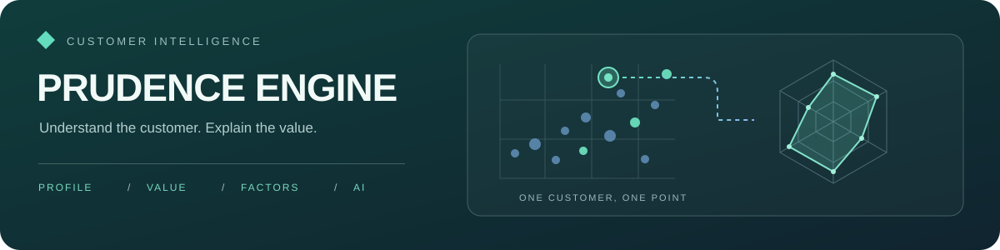
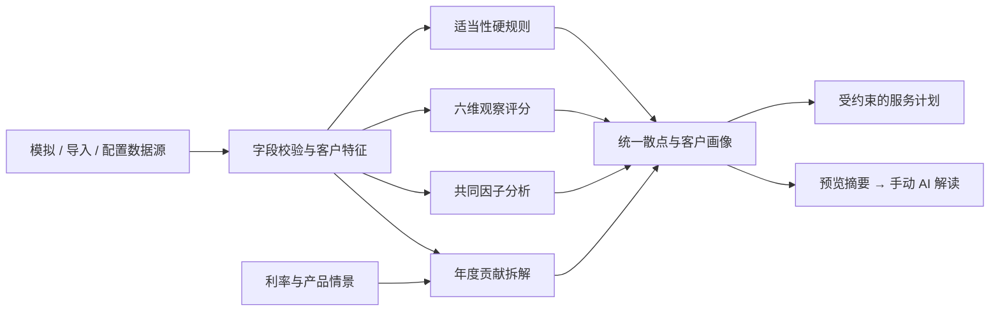

<p align="center">
  
</p>

<h1 align="center">睿衡引擎 · Prudence Engine</h1>
<p align="center"><strong>看见客户特征，理解价值来源。</strong><br>集客户评分、联动画像、价值情景、因子分析与多模型 AI 解读于一体的分析原型。</p>

<p align="center">
  <a href="https://github.com/ilovemiku520/prudence-engine/actions/workflows/tests.yml"></a>
  
  
  <a href="LICENSE"></a>
</p>

<p align="center">
  <a href="#quickstart">快速开始</a> ·
  <a href="#features">功能一览</a> ·
  <a href="docs/usage.md">使用与配置</a> ·
  <a href="docs/ai-analysis.md">接入大模型</a> ·
  <a href="docs/customer-scoring-research.md">研究依据</a>
</p>

> **使用授权**：原创内容保留所有权利，使用前须取得书面许可。安装与开发说明不构成授权，完整条款见 [LICENSE](LICENSE)。

睿衡把“客户在哪里、为什么得这个分、价值由什么构成”放在同一条分析路径中。点选客户，查看画像；调整存贷款利率与理财策略，观察年度贡献变化；在明确的计算结果上继续做因子分析、服务计划和 AI 解读。

[访问演示站](https://prudence-engine-ilovemiku520.streamlit.app/) · 演示站的部署版本可能与当前分支不同。默认看板使用固定种子的 **120 位模拟客户**，无需连接数据库或填写 AI 密钥即可体验统计功能。

看板采用轻量启动：不加载 XGBoost / SHAP、不训练意图模型；因子分析和画像贡献拆解按需计算。免费托管仍可能休眠或遇到网络等待。容器运行及免费备用部署见 [部署与性能](docs/deployment.md)。

<a id="features"></a>
## 一张看板，完整分析路径

| 你想回答的问题 | 看板中的能力 |
| :--- | :--- |
| 客户如何分布？ | 关注度 × 匹配度、关注度 × 年度贡献、共同因子三个散点视角；筛选、框选、套索与榜单联动 |
| 这个客户有什么特点？ | 点击散点可以查看客户的六维雷达、综合观察分、原始指标与适当性；缺失保持为空 |
| 客户价值从哪里来？ | 存贷款利差、理财费用、预期损失和服务成本拆解；机构贡献与客户净收支分别展示 |
| 换一个经营情景会怎样？ | 自定义利率、FTP、产品收益与费用、资金占比、贷款余额假设，以及产品风险、期限和起投额 |
| 多个指标反映了哪些共同特征？ | 最大似然因子分析 + Varimax；载荷、共同度、独特方差与稳定性诊断 |
| 有限资源优先服务谁？ | 预算、人数与容量约束下的 0–1 分配；只纳入规则可通过且满足配置条件的完整画像 |
| 如何解释这些结果？ | 选择配置api后，AI 解释当前群体、所选客户或因子摘要 |

**六维画像**：近期活跃 · 决策投入 · 互动响应 · 风险适配 · 资金余量 · 期限匹配。

**一套上下文**：散点、画像、榜单和服务计划共用当前客户与产品。更改数据、利率或问题后，旧计划和旧 AI 解读不会继续显示为当前结果。

**项目定位**：本科生大数据分析选修课期末大作业。

<a id="quickstart"></a>
## 快速开始

需要 Python **3.10+**；持续集成使用 Python 3.11，本地也已验证 Python 3.12。以下步骤适用于已取得使用授权的用户。

```bash
git clone https://github.com/ilovemiku520/prudence-engine.git
cd prudence-engine
python -m venv .venv
```

<details>
<summary>激活虚拟环境：选择你的系统</summary>

```powershell
# Windows PowerShell
.\.venv\Scripts\Activate.ps1
```

```bash
# macOS / Linux
source .venv/bin/activate
```

</details>

```bash
python -m pip install -r requirements.txt
python -m streamlit run ui.py
```

浏览器打开 `http://localhost:8501`。首次运行会为保留的决策接口准备合成数据训练的意图模型；该模型不是经过真实业务验证的预测模型，也不用于看板的六维观察评分。

1. 在散点中选择一位客户，查看右侧雷达与贡献拆解。
2. 打开左侧“利率与理财策略”，修改参数并点击“应用利率与策略”。
3. 在“共同因子与稳定性”核对指标结构，或在“服务计划”设置资源约束。
4. 在“AI 辅助解读”填入自己的接口配置，预览摘要后手动发送。

需要导入客户数据、连接数据库或启动 REST 服务？查看 [使用与配置](docs/usage.md)。`.env.example` 是环境变量清单，**复制成 `.env` 不会自动加载**。

## 多模型 AI 辅助解读

| 接口家族 | 可配置的服务 |
| :--- | :--- |
| Responses / Chat Completions | OpenAI；Azure OpenAI v1 按兼容方式配置 |
| OpenAI 兼容 Chat | DeepSeek、通义千问 / 百炼、Ollama 及其他兼容网关 |
| Messages | Claude / Anthropic |
| Generate Content | Gemini |

模型名、地址、密钥和输出上限均由用户配置。只有点击发送才调用外部服务；默认发送去除姓名与客户 ID 的数值摘要，页面密钥只保留在当前会话。去标识摘要仍可能包含敏感业务信息，发送前请核对预览。

[完整接入指南 →](docs/ai-analysis.md) 包含本地模型、Azure v1、鉴权方式、受保护的解释 API 和已验证的协议范围。当前自动测试使用模拟响应，未以真实密钥完成各厂商在线联调。

## 计算链路



看板的观察评分与独立决策接口的 XGBoost 意图分各有定义。后者通过 `Prudence → Intent → Aegis` 完成适当性优先的融合决策；AI 只解释已有结果，不重写任何评分或规则。

## 文档导航

| 文档 | 内容 |
| :--- | :--- |
| [使用与配置](docs/usage.md) | 页面操作、数据字段、环境变量、CLI 与 API |
| [计算方法](docs/analytics-methods.md) | 评分公式、价值口径、因子分析与优化约束 |
| [研究到实现](docs/customer-scoring-research.md) | 论文、开源参考及实现取舍 |
| [AI 接入](docs/ai-analysis.md) | 模型协议、密钥、发送摘要和错误处理 |
| [维护与迁移](docs/maintenance.md) | 验证方式、代码分层、旧入口迁移与 README 设计参考 |
| [部署与性能](docs/deployment.md) | 启动优化、免费平台限制、Docker 和 Render 备用方案 |

## 开发与验证

```bash
python -m pip install -r requirements-dev.txt
python -m pytest -q
```

测试覆盖评分与规则、金额守恒与敏感性、因子结构、服务分配、数据导入、页面联动、AI 协议及安全边界。测试通过表示这些实现约束成立，不代表真实客户转化或经营效果。

```text
ui.py → dashboard.py           统一看板入口与客户交互
customer_scoring.py            六维评分、价值情景与因子分析
dashboard_data.py              视觉样式、导入与导出
dashboard_ai.py                AI 配置、摘要预览与结果展示
analysis_context.py            数值白名单与结果失效判定
ai_explainer.py                多模型文本接口适配
analytics.py                  分配优化与 PCA / SVD / 博弈数值工具
main.py → api.py               命令行、引擎组装与 REST 接口
data_source.py                模拟、内存与关系数据库适配
workbench_data.py             导入校验与可复现模拟样本
tests/ · docs/                回归测试与方法文档
```

## 结果应该怎样理解

- **观察分 ≠ 购买概率或信用评级**；高分不能覆盖 `RESTRICTED / FORBID`。
- **年度贡献 ≠ 实际利润或客户终身价值**；采用固定余额的一年简化情景，利率不是实时报价。
- 因子与相关性用于探索，不能证明因果；AI 文本须对照计算值复核。
- 项目是分析与决策原型。生产身份认证、限流、高可用及持久化审计需由部署环境实现；当前进程内审计与指标会在重启后丢失。

---

<!-- BEGIN RIGHTS NOTICE -->
## 版权与使用限制 / Copyright and use restrictions

**保留所有权利。未经著作权人事先书面许可，不得使用、运行、复制、修改或分发本项目受保护的原创内容，包括个人、学习、研究、非商业和商业用途，以及依法需要许可的 AI 使用。**

**All rights reserved. Prior written permission is required to use, run, copy, modify or distribute the project's protected original material, including personal, educational, research, non-commercial and commercial use, and AI use where permission is required by law.**

完整条款见 [LICENSE](LICENSE)。第三方内容仍适用其各自许可；此前已授予的许可、法定权利及 GitHub 平台条款项下权利不受影响。本文中的安装、运行及开发说明仅为技术说明，不构成使用授权。

See [LICENSE](LICENSE) for the full terms. Third-party licenses, previously granted permissions, statutory rights and rights under GitHub's Terms of Service remain unaffected. Setup, usage and development instructions are technical documentation, not permission to use the material.

书面授权 / Permission requests: [ilovemiku520@outlook.com](mailto:ilovemiku520@outlook.com)

关注初音未来谢谢喵，ilovemiku520  
Please follow Hatsune Miku, thank you, meow. ilovemiku520
<!-- END RIGHTS NOTICE -->

作者：[@ilovemiku520](https://github.com/ilovemiku520) · [联系作者](mailto:ilovemiku520@outlook.com)
